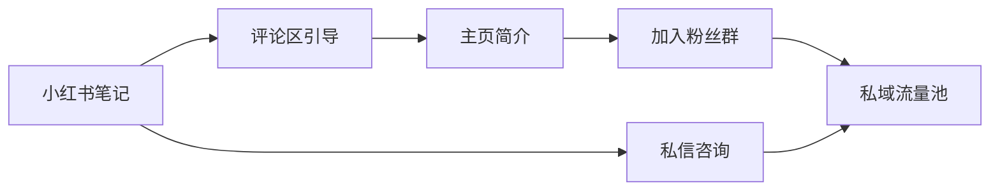

# 小红书运营引流变现计划
## 一、文档概述
### 1.1 核心目标
- 提高小红书帖子流量，适配平台推流机制
- 内容垂直深耕小学信息技术/信息科技领域
- 吸引精准高质量用户（小学信息技术老师、教研人员、培训机构）关注
- 引流到私域流量池，实现多渠道变现
### 1.2 受众定位
- 核心受众：小学信息技术/信息科技任课老师、教研人员
- 次要受众：编程培训机构运营者、小学家长、信息科技赛事组织者
### 1.3 时间范围
2026年5月 - 2026年12月
## 二、小红书推流机制适配策略（流量提升）
### 2.1 算法核心逻辑适配
| 算法维度 | 适配策略 | 具体操作 |
|---------|---------|---------|
| 完读率 | 内容短小精悍，开头3秒抓住注意力 | 首图用"痛点+利益点"，开头第一句直接戳老师痛点："批改编程作业改到凌晨的老师举个手🙋" |
| 互动率 | 设计互动钩子，引导用户评论、点赞、收藏 | 结尾提问："你们学校开编程课了吗？评论区聊聊"，设置福利："需要这份教案的老师扣1" |
| 转发率 | 提供高价值可复用内容，让用户愿意转发 | 发布可直接落地的教案、课件、活动方案，标注"老师可以直接用，建议转发收藏" |
| 关注率 | 主页内容有明确价值定位，引导关注 | 简介写清楚"每周分享3个小学信息技术教学干货，关注我不迷路" |
### 2.2 流量放大技巧
1. **关键词布局**：
   - 标题、正文、标签里埋入高搜索量关键词：#小学信息技术 #信息科技 #编程教学 #少儿编程 #信息技术教案
   - 长尾关键词："小学信息技术教案"、"信息科技新课标"、"编程社团课"、"小学Python教学"
2. **发布时间优化**：
   - 工作日早8:00（老师上班通勤时间）
   - 工作日午12:30（午休刷手机时间）
   - 工作日晚20:00（老师备课时间）
   - 周末上午10:00（老师休闲浏览时间）
3. **热点结合**：
   - 结合信息科技新课标发布、编程比赛报名、开学季、期末复习等时间节点发布相关内容
   - 跟进小红书平台教育类热点话题，蹭流量
## 三、内容垂直化运营方案
### 3.1 内容定位
- 100%聚焦小学信息技术/信息科技领域，不发布无关内容
- 内容价值定位："小学信息技术老师的教学资源宝库"
### 3.2 内容矩阵（7:2:1配比）
| 内容类型 | 占比 | 内容方向 |
|---------|------|---------|
| 教学干货 | 70% | 教案、课件、教学设计、比赛方案、教学技巧（维持现有风格，保持用户粘性） |
| 工具推荐 | 20% | OJ编程平台使用、教学工具推荐、效率软件（植入产品，引流转化） |
| 行业资讯 | 10% | 新课标解读、赛事信息、教育政策、行业动态（提升专业度，扩大受众） |
### 3.3 高流量内容模板
#### 模板1：痛点解决型
```
标题：《再也不用____，小学信息技术老师福音！》
首图：对比图（手动批改vs自动批改）
正文：
1. 痛点描述："有没有老师和我一样，每次上完编程课，批改作业要花2小时？"
2. 解决方案："最近发现这个自动评测工具，学生提交代码立刻出结果，我终于不用熬夜改作业了！"
3. 使用演示：简单介绍功能，展示使用效果
4. 互动引导："需要试用的老师扣1，我发你地址"
```
#### 模板2：资源分享型
```
标题：《小学信息技术____课件，直接用！》
首图：课件截图/板书照片
正文：
1. 资源介绍："整理了一套三年级编程课课件，包含教案+PPT+配套练习"
2. 内容展示：放几张课件内容截图
3. 福利引导："需要的老师评论区留【课件】，我发你"
```
#### 模板3：经验分享型
```
标题：《我做小学信息技术老师5年，总结出这些经验》
首图：个人工作照/教室照片
正文：
1. 个人经验分享："带了3年编程社团，学生获奖率80%，靠的就是这几个方法"
2. 具体方法介绍：分点列出实用技巧
3. 价值引导："想知道我用什么平台带学生练习的，可以进我主页群聊"
```
## 四、用户引流与私域转化路径
### 4.1 引流路径设计

### 4.2 引流钩子设计
1. **低门槛钩子（90%用户可获得）**：
   - 免费领取《小学信息技术教学资源大礼包》（包含教案、课件、比赛方案）
   - 免费加入"全国小学信息技术老师交流群"
   - OJ平台7天免费试用权限
2. **中门槛钩子（10%高意向用户可获得）**：
   - 1对1小学编程教学规划咨询
   - 免费编程比赛活动策划方案
   - OJ平台1个月高级会员
### 4.3 私域运营策略
1. **群运营**：
   - 每日分享1个教学干货资源
   - 每周1次教学经验分享会
   - 定期发布OJ平台使用技巧、新功能介绍
   - 收集老师需求，迭代产品功能
2. **朋友圈运营**：
   - 每日更新：教学干货、用户反馈、平台新功能
   - 每周更新：成功案例、合作学校展示
   - 每月更新：促销活动、福利放送
## 五、变现体系设计
### 5.1 变现方式1：课件/教学资源售卖（面向老师）
#### 产品矩阵
| 产品 | 价格 | 内容 |
|------|------|------|
| 单份课件 | ¥9.9 - ¥29.9 | 单节课教案+PPT+配套练习 |
| 年级课件包 | ¥99 - ¥199 | 1-6年级全学期信息技术课件包 |
| 专项资源包 | ¥199 - ¥399 | 编程比赛方案、社团课方案、新课标落地资料 |
| 年度会员 | ¥365/年 | 全年更新所有课件资源+OJ平台教师版权限 |
#### 交付方式
- 课件资源统一上传到OJ平台课件商城，用户购买后直接在平台下载
- 会员用户直接解锁全部课件资源
### 5.2 变现方式2：广告合作（面向培训机构）
#### 合作类型
| 广告类型 | 价格 | 合作方式 |
|---------|------|---------|
| 笔记植入 | ¥1000 - ¥3000/条 | 笔记内容中植入培训机构课程、产品、活动信息 |
| 群内推广 | ¥500 - ¥2000/次 | 私域群内发布培训机构招生、活动信息 |
| 专场直播 | ¥3000 - ¥8000/场 | 专门为培训机构做直播宣讲、课程推广 |
| 联合活动 | 协商分成 | 联合举办编程比赛、师资培训等活动，收入分成 |
#### 广告审核标准
- 只接受编程教育、信息科技相关的正规培训机构合作
- 不接受K12学科类、虚假宣传、质量不佳的广告
- 广告内容不能影响用户体验，每月广告不超过4条
### 5.3 变现方式3：OJ系统售卖（面向学校/机构）
| 产品版本 | 价格 | 目标用户 |
|---------|------|---------|
| 教师个人版 | ¥199/年 | 单个信息技术老师，支持50个学生账号 |
| 学校标准版 | ¥1999/年 | 小学/初中学校，支持500个学生账号+学校管理后台 |
| 机构高级版 | ¥3999/年 | 编程培训机构，支持1000个学生账号+定制功能 |
| 区域定制版 | 面议 | 教育局/教研机构，支持多学校管理、专属部署、定制开发 |
### 5.4 变现预期（第一年）
- 课件/资源售卖：¥10万 - ¥20万
- 广告合作：¥5万 - ¥10万
- OJ系统售卖：¥50万 - ¥100万
- 总预期：¥65万 - ¥130万
## 六、内容发布计划表（2026年5-6月）
| 周数 | 内容主题 | 内容类型 | 预计发布时间 |
|------|---------|---------|-------------|
| 第1周 | 《再也不用手动批改编程作业了！这个自动评测工具太香了》 | 工具推荐 | 5月15日 |
| | 《三年级信息技术下册全册教案分享，直接用！》 | 教学干货 | 5月17日 |
| | 《小学编程社团课这样上，家长都抢着报名》 | 经验分享 | 5月19日 |
| 第2周 | 《3分钟创建一个编程比赛，自动排名+自动发奖，太省心了》 | 工具推荐 | 5月22日 |
| | 《信息科技新课标这样落地，校长都夸你专业》 | 经验分享 | 5月24日 |
| | 《小学Python入门课件分享，适合3-4年级》 | 教学干货 | 5月26日 |
| 第3周 | 《我用这个平台带学生打比赛，获奖率提升了40%》 | 经验分享 | 5月29日 |
| | 《一年级信息技术趣味课件，让学生爱上信息课》 | 教学干货 | 5月31日 |
| | 《老师必看！5个提高编程课课堂效率的工具》 | 工具推荐 | 6月2日 |
| 第4周 | 《期末信息科技考试复习资料整理，老师直接用》 | 教学干货 | 6月5日 |
| | 《编程机构想合作的老师看过来，利润分成高达50%》 | 广告合作 | 6月7日 |
| | 《OJ平台小学版全新上线，前100名老师免费使用1年》 | 产品推广 | 6月9日 |
## 七、效果追踪与优化
### 7.1 数据追踪指标
| 维度 | 指标 | 目标 |
|------|------|------|
| 流量指标 | 笔记播放/浏览量 | 平均每条≥1000，爆款≥10000 |
| 互动指标 | 点赞+收藏+评论 | 平均每条≥50，互动率≥5% |
| 引流指标 | 每日加群人数 | 平均每日≥20人 |
| 转化指标 | 月度变现金额 | 第一个月≥1万，第三个月≥5万 |
### 7.2 优化机制
- 每周复盘：分析上周内容数据，保留高互动内容方向，淘汰低互动内容
- A/B测试：同一主题尝试不同标题、首图，测试哪种效果更好
- 用户调研：定期在群内收集用户需求，调整内容方向和产品功能
## 八、风险控制
1. **内容合规**：严格遵守小红书平台规则，不发布违规内容，避免账号限流、封禁
2. **广告合规**：广告内容标注"广告"，不虚假宣传，保障用户权益
3. **用户隐私**：严格保护用户隐私信息，不泄露老师个人信息、联系方式
4. **知识产权**：所有分享的课件、资源确保有合法版权，避免侵权纠纷
