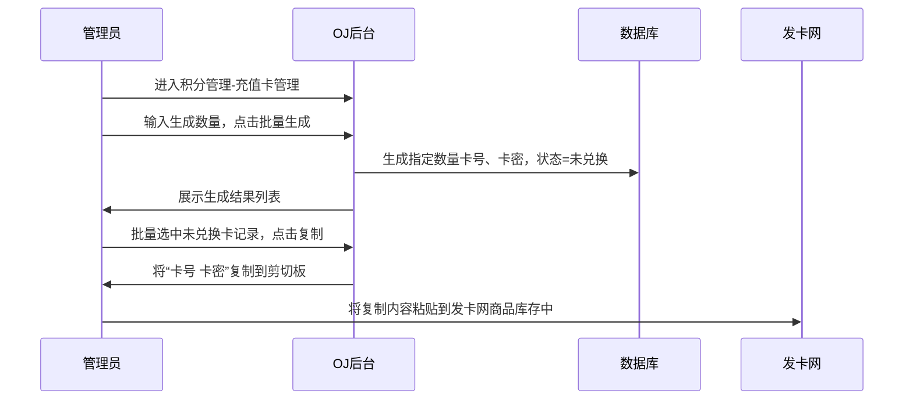
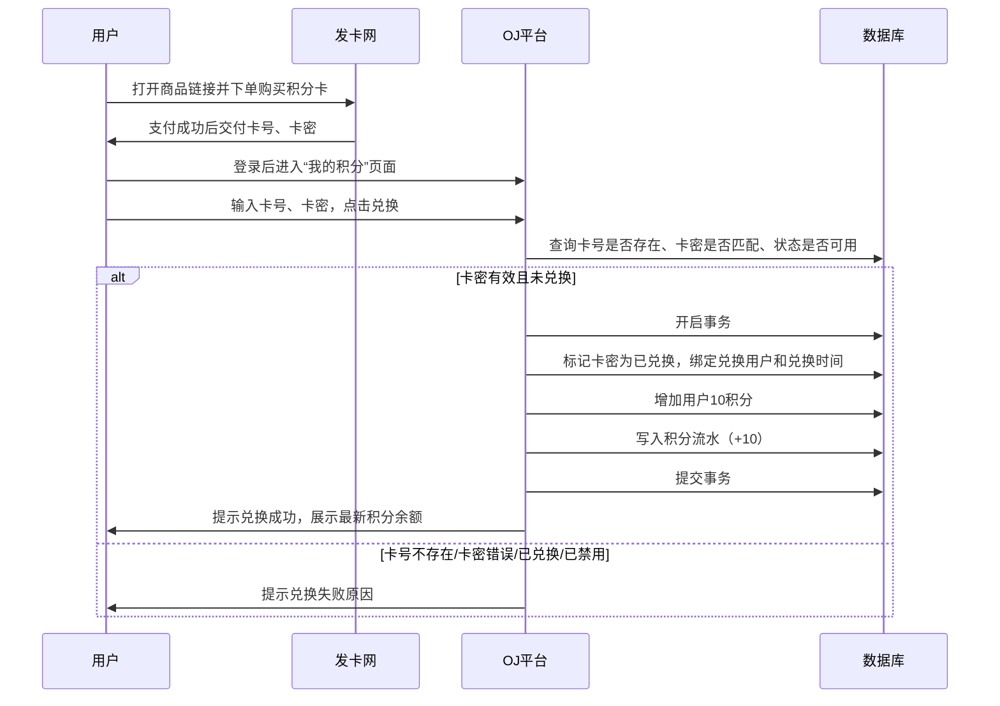
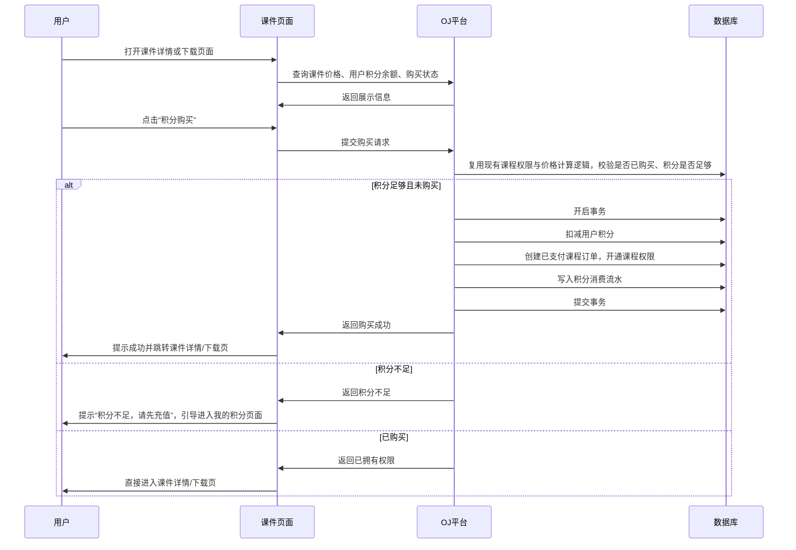

# 需求文档：平台积分充值与课件积分支付体系

**版本**：v1.3  
**日期**：2026年6月7日  
**状态**：待评审  
**适用项目**：HUSTOJ / syzoj 模板  
**核心调整**：课件支付改为平台积分支付，积分通过发卡网卡号/卡密兑换充值  
**发卡网商品链接**：<https://www.qianxun1688.com/details/8E870BDF>

---

## 一、需求背景

现有课件购买需要改造为**平台积分支付**。用户先在发卡网购买积分充值卡，获取卡号和卡密后回到 OJ 平台兑换积分，再使用积分购买课件。

本方案不在 OJ 平台内直接接入支付宝支付接口，收款与卡密交付由发卡网完成，OJ 平台只负责：

1. 管理员批量生成卡号、卡密。
2. 管理员将卡号、卡密复制后导入发卡网商品库存。
3. 用户使用发卡网获取到的卡号、卡密兑换积分。
4. 用户使用平台积分购买课件。
5. 平台记录积分充值、消费和管理流水。

每张充值卡固定兑换 **10 积分**，不做多面值配置。平台统一采用 **1 积分 = 1 元** 的价格口径；课件价格继续复用现有课程价格字段，但用户端和管理端展示时统一按“积分”表达。

业务上确认当前生产数据不需要兼容支付宝历史订单；实现时可删除或隐藏现有支付宝支付入口和支付宝回调逻辑，不做支付宝历史订单展示和迁移。

---

## 二、建设目标

### 2.1 业务目标

- 将课件购买改造为“积分购买课件”。
- 将用户菜单“我的订单”改为“我的积分”。
- 支持用户通过卡号、卡密兑换平台积分。
- 每张有效充值卡固定兑换 **10 积分**。
- 支持管理员在后台充值卡管理页面批量生成指定数量的卡号、卡密。
- 支持管理员批量选中充值卡记录后，一键复制“卡号 卡密”到剪切板，用于导入发卡网。
- 支持用户查看积分余额、充值记录、消费记录。
- 支持后台查询卡密状态、兑换记录和积分流水，便于售后处理。
- 课件购买改造优先复用现有课程权限、价格计算和订单逻辑，避免重复设计课程授权体系。
- 明确平台价格口径为 **1 积分 = 1 元**，用户端和管理端课件价格展示统一改为积分语义。

### 2.2 非目标

- 本期不在 OJ 平台内实现在线收款。
- 本期不对接发卡网 API 自动同步订单。
- 本期不支持 CSV 导出卡密，由后台列表批量选择后复制到剪切板即可。
- 本期不支持多面值充值卡，所有充值卡统一兑换 10 积分。
- 本期不支持积分提现、积分转账、积分赠送给其他用户。
- 本期不支持同一卡号、卡密多次兑换。
- 本期不新增卡密复制审计表，不实现复制审计功能；卡密安全通过管理员权限控制、接口鉴权、后台脱敏展示、禁止前台输出卡密、禁止日志记录明文卡密来保障。
- 本期不新增单独的课件积分价格字段，复用现有课程价格字段和价格计算逻辑。

---

## 三、用户角色与权限

| 用户角色 | 功能权限 |
| --- | --- |
| 游客 | 可浏览公开课件/课程说明；进入充值、购买、兑换页面时要求登录 |
| 普通用户 | 查看积分余额、输入卡号卡密兑换 10 积分、查看积分流水、使用积分购买课件 |
| 管理员 | 批量生成卡号卡密、批量复制卡号卡密、查询卡密状态、禁用卡密、查询用户积分流水、手动调整积分 |

---

## 四、核心功能总览

| 模块 | 功能说明 |
| --- | --- |
| 导航菜单改造 | 右上角用户菜单中“我的订单”改名为“我的积分” |
| 我的积分页面 | 展示余额，提供卡密兑换入口，展示充值/消费流水 |
| 卡密兑换 | 用户输入发卡网购买得到的卡号、卡密，平台校验后固定发放 10 积分 |
| 课件购买改造 | 课件支付方式改为积分支付，复用现有课程权限和订单体系 |
| 后台充值卡管理 | 管理员批量生成卡号卡密、查询状态、批量复制卡号卡密、禁用未兑换卡 |
| 后台积分管理 | 查询兑换记录、积分流水，支持手动调整积分 |

---

## 五、业务流程设计

### 5.1 管理员生成并导入发卡网流程



### 5.2 用户积分充值流程



### 5.3 课件积分购买流程



---

## 六、前台功能需求

### 6.1 导航菜单改造

- 位置：右上角用户下拉菜单。
- 将原菜单项“我的订单”文案改为“我的积分”。
- 点击后跳转到积分中心页面，建议路径：`/point_index.php`。
- 业务上不需要展示支付宝历史订单。

### 6.2 我的积分页面

建议页面路径：`trunk/web/point_index.php`，模板路径按 syzoj 现有模板规则放置。

页面包含以下区域：

#### 6.2.1 积分概览

- 展示当前用户积分余额。
- 展示充值说明：用户需先通过发卡网商品链接购买积分卡，再回到本页面兑换。
- 展示发卡网商品链接：<https://www.qianxun1688.com/details/8E870BDF>。

#### 6.2.2 充值卡兑换

字段：

| 字段 | 要求 |
| --- | --- |
| 卡号 | 必填，去除首尾空格，建议支持大写字母和数字 |
| 卡密 | 必填，去除首尾空格，格式与后台生成格式一致 |
| 验证码/CSRF | 表单提交必须具备 CSRF 防护，后台校验 `check_post_key.php` 或等效机制 |

兑换按钮文案：`立即兑换`。

兑换结果：

| 场景 | 提示 |
| --- | --- |
| 兑换成功 | `兑换成功，已到账 10 积分` |
| 卡号不存在 | `卡号或卡密错误，请核对后重试` |
| 卡密错误 | `卡号或卡密错误，请核对后重试` |
| 已兑换 | `该充值卡已被兑换，如有疑问请联系管理员` |
| 已禁用 | `该充值卡不可用，请联系管理员` |
| 系统异常 | `兑换失败，请稍后重试或联系管理员` |

为避免泄露卡号枚举信息，前台对“卡号不存在”和“卡密错误”使用相同提示。

#### 6.2.3 积分流水

列表字段：

| 字段 | 说明 |
| --- | --- |
| 时间 | 交易发生时间 |
| 类型 | 充值卡兑换、购买课件、管理员调整、系统操作 |
| 积分变动 | 正数显示绿色 `+X`，负数显示红色 `-X` |
| 交易后余额 | 本次交易完成后的积分余额 |
| 备注 | 如“充值卡兑换”“购买课件《XXX》” |

要求：

- 默认按时间倒序。
- 支持分页，建议每页 20 条。
- 支持按类型筛选。
- 仅允许用户查看自己的流水。

#### 6.2.4 购买记录

“我的积分”页面可提供“购买记录”Tab：

- 展示已购买课件名称、消耗积分、购买时间。
- 新订单统一显示支付方式为“积分支付”。
- 不展示支付宝历史订单相关字段。

### 6.3 用户端课件页面展示调整

平台统一采用 **1 积分 = 1 元** 的价格口径。用户端课件相关页面不再以 `¥` 作为主要支付单位，统一展示为“积分”。

#### 6.3.1 课程列表页

涉及页面：`trunk/web/course.php`、`trunk/web/template/syzoj/course.php`。

调整要求：

- 继续读取现有 `preview_price`、`source_price`。
- 原 `¥X`、`¥X起` 展示改为 `X 积分`、`X 积分起`。
- 价格区域可补充说明：`1积分=1元`。
- 按钮文案可由“购买”调整为“查看详情”“积分获取”或“立即解锁”，避免用户误以为仍在站内直接人民币支付。
- 如页面展示“已拥有”，需结合现有 `license_type` 区分用户已拥有完整预览权限还是原文件权限；只拥有预览权限时仍应允许升级到原文件权限。

#### 6.3.2 课程详情页

涉及页面：`trunk/web/course_info.php`、`trunk/web/template/syzoj/course_info.php`。

调整要求：

- `预览版：¥X` 改为 `完整预览版：X 积分`。
- `原文件版：¥X` 改为 `原文件版：X 积分`。
- `升级到原文件版 ¥X` 改为 `升级到原文件版，补差 X 积分`。
- `解锁完整预览 ¥X` 改为 `消耗 X 积分解锁完整预览`。
- `解锁原文件下载 ¥X` 改为 `消耗 X 积分解锁原文件下载`。
- “购买”“买断”“选购”等强支付语义文案，建议调整为“获取”“解锁”“积分获取”。
- “一次性买断，永久使用”建议调整为“积分解锁后永久使用”或“获取后永久使用”。

#### 6.3.3 课程获取/支付确认页

涉及页面：`trunk/web/course_get.php`、`trunk/web/template/syzoj/course_get.php`。

该页面是本次课件支付改造的重点。原支付宝支付确认页需要改造为积分扣减确认页。

页面展示要求：

- 不展示支付宝支付方式。
- 不展示 `¥` 支付金额作为主要信息。
- 展示课程名称、获取类型、所需积分、当前积分余额、扣减后剩余积分。
- 支付方式固定展示为 `积分支付`。
- 积分足够时按钮文案为 `确认消耗 X 积分` 或 `确认消耗 X 积分升级`。
- 积分不足时按钮不可用，展示 `积分不足，请先充值`，并提供跳转“我的积分”的入口。

示例：

```text
课程：XXX
获取类型：完整预览版
所需积分：10
当前积分：25
支付方式：积分支付
确认后将扣除 10 积分。
[确认消耗 10 积分]
```

积分不足示例：

```text
所需积分：30
当前积分：10
积分不足，请先充值。
[去我的积分充值]
```

#### 6.3.4 我的课件/购买记录页

涉及页面：`trunk/web/course_my.php`、`trunk/web/template/syzoj/course_my.php`。

调整要求：

- 不再使用旧字段 `course.price` 展示价格。
- 使用 `course_order.amount` 展示订单实际消耗积分。
- 展示 `course_order.license_type`，映射为“完整预览版”“原文件版”。
- 展示 `course_order.pay_channel`，积分订单展示为“积分支付”。
- 金额展示统一为 `X 积分`。
- 建议列表字段为：课件名称、获取类型、消耗积分、支付方式、获取时间、操作。

示例：

```text
Python 入门课件 | 原文件版 | 30 积分 | 积分支付 | 2026-06-07 | 查看课件
```

---

## 七、课件支付逻辑改造

### 7.1 页面展示

课件购买入口应展示：

- 课件名称。
- 所需积分。
- 当前积分余额。
- 购买状态。
- 价格口径说明：`1积分=1元`。

按钮规则：

| 状态 | 按钮文案 | 行为 |
| --- | --- | --- |
| 未登录 | `登录后获取` | 跳转登录页，登录后返回当前页面 |
| 已购买 | `已获取，查看课件` | 跳转课件详情或下载页 |
| 未购买且积分足够 | `确认消耗 X 积分` | 二次确认后扣积分购买 |
| 未购买且积分不足 | `积分不足，去充值` | 跳转“我的积分”页面 |

### 7.2 复用现有课程逻辑

课件购买改造应优先复用现有课程权限模型和订单模型，不重新设计课程授权体系：

- 继续复用 `course_order` 表作为课件购买订单表。
- 继续复用 `license_type` 权限模型：`1` 表示完整预览权限，`2` 表示原文件权限。
- 继续复用 `pay_status=1` 作为已支付/已开通权限的判断条件。
- 继续复用 `get_user_course_permission()` 判断用户是否已有权限。
- 继续复用 `calculate_course_price()` 计算课程当前应付价格和升级差价。
- 改造或复用 `grant_course_license()` 完成课程订单创建、权限开通、下载次数统计。
- 积分支付只替换原支付动作：从“创建支付订单并等待第三方回调”改为“校验积分、扣减积分、创建已支付订单、开通权限”。

### 7.3 后端购买规则

- 不信任前端传递的课件价格和积分余额，价格必须由后端根据课程 ID 和 `license_type` 计算。
- 不新增 `course.price_point` 字段，复用现有 `preview_price`、`source_price` 作为积分价格字段。
- 购买预览权限使用 `preview_price`，字段数值按积分解释，`1积分=1元`。
- 购买原文件权限使用 `source_price`，字段数值按积分解释，`1积分=1元`。
- 从预览权限升级到原文件权限时，继续复用现有升级差价逻辑。
- 课件价格建议按非负整数积分录入和展示；如现有字段为 decimal 类型，本期不改字段类型，但管理端输入和后端校验应限制为非负整数，避免出现小数积分。
- 扣减积分、创建订单、开通权限、写入流水必须在同一个数据库事务内完成。
- 购买接口必须校验用户登录态。
- 重复点击购买按钮时必须幂等处理：已购买则直接返回成功或“已拥有”。
- 积分不足时不得创建成功订单，不得开通课件权限。
- 不保留支付宝支付入口，不生成支付宝支付订单。
- 课程订单中可复用现有 `amount` 字段记录本次消耗积分，`pay_channel` 固定写入 `point`，`pay_status=1` 表示积分扣减并开通成功。

---

## 八、后台管理需求

### 8.1 菜单位置

管理后台菜单应配置在 `trunk/web/admin/menu2.php`。

建议新增一级或二级菜单：`积分管理`，包含：

1. 充值卡管理。
2. 兑换记录。
3. 积分流水。
4. 手动调整积分。

后台权限统一使用：

```php
$_SESSION[$OJ_NAME.'_'.'administrator']
```

后台表单提交必须引入：

```php
require_once("../include/check_post_key.php");
```

### 8.2 充值卡管理

#### 8.2.1 权限要求

- 充值卡管理页面仅管理员可访问。
- 批量生成、批量复制、禁用卡密等相关接口也必须单独校验管理员权限，不能只依赖前端隐藏入口。
- 非管理员访问页面或接口时应直接拒绝。

#### 8.2.2 列表查询

展示字段：

| 字段 | 说明 |
| --- | --- |
| 勾选框 | 支持批量选择记录 |
| 卡号 | 充值卡卡号 |
| 卡密 | 充值卡卡密，建议默认脱敏显示，复制时复制完整值 |
| 固定积分 | 固定显示 10，数据库不需要单独保存每张卡积分面值 |
| 状态 | 未兑换、已兑换、已禁用 |
| 生成批次 | 后台生成时自动生成或管理员填写 |
| 兑换用户 | 已兑换时显示用户 ID / 用户名 |
| 兑换时间 | 已兑换时显示 |
| 创建时间 | 卡生成时间 |

筛选条件：

- 卡号。
- 生成批次。
- 状态。
- 兑换用户。
- 创建时间范围。

#### 8.2.3 批量生成卡号卡密

管理端充值卡管理页面提供“批量生成”功能。

输入项：

| 输入项 | 要求 |
| --- | --- |
| 生成数量 | 必填，正整数，建议单次最多 1000 条 |
| 批次号 | 可选；不填则系统自动生成，如 `PC20260607A` |

固定规则：

- 每张卡固定兑换 **10 积分**。
- 管理员不需要输入积分面值。
- 生成后状态默认为“未兑换”。
- 卡号唯一，数据库通过唯一索引约束。
- 卡密随机生成，不允许手工指定。

生成完成后：

- 页面提示生成成功数量。
- 自动筛选并展示本批次记录。
- 管理员可直接勾选本批次记录并点击“复制卡号卡密”。

#### 8.2.4 批量复制卡号卡密

充值卡管理页面提供批量复制功能，不需要 CSV 导出。

操作方式：

1. 管理员在列表中勾选一条或多条充值卡记录。
2. 点击按钮：`复制卡号卡密`。
3. 前端将选中记录按行复制到剪切板。
4. 管理员将剪切板内容粘贴到发卡网商品库存中。

复制格式建议：

```text
卡号 卡密
PC20260607A8M3KQ9W2 D7M9-P2XA-K8QF-Z6TV
PC20260607AQ7N4P6XB A2KP-Q8WX-L6MN-Z3RV
```

或按发卡网导入要求调整为：

```text
PC20260607A8M3KQ9W2----D7M9-P2XA-K8QF-Z6TV
PC20260607AQ7N4P6XB----A2KP-Q8WX-L6MN-Z3RV
```

具体分隔符以发卡网后台商品库存导入格式为准。

复制限制：

- 默认仅允许复制“未兑换”状态的卡。
- 已兑换卡不建议复制；如确需展示，应明确标识已兑换状态，避免误导导入发卡网。
- 本期不做复制审计，不新增复制日志表。

#### 8.2.5 禁用卡密

- 支持禁用未兑换卡。
- 已兑换卡不可禁用，仅可查看。
- 禁用后用户兑换时提示“该充值卡不可用，请联系管理员”。

状态定义：

| 状态值 | 状态 | 说明 |
| --- | --- | --- |
| 0 | 未兑换 | 可被用户兑换 |
| 1 | 已兑换 | 已绑定用户，不可再次使用 |
| 2 | 已禁用 | 管理员禁用，不可兑换 |

### 8.3 兑换记录

展示字段：

- 卡号。
- 固定积分：10。
- 兑换用户 ID / 用户名。
- 兑换时间。
- 兑换 IP。
- 批次号。

### 8.4 积分流水

支持管理员按用户、类型、时间范围查询全部积分流水。

### 8.5 手动调整积分

用于售后和运营处理：

- 管理员选择用户。
- 输入调整积分，可正可负。
- 必须填写调整原因。
- 写入积分流水，类型为“管理员调整”。
- 操作前后记录余额。

### 8.6 管理端课程管理页面调整

平台采用 **1积分=1元** 后，管理端课程价格仍复用现有课程字段，但页面录入和展示需要统一为积分语义。

#### 8.6.1 课程新增页

涉及页面：`trunk/web/admin/course_add.php`。

调整要求：

- `预览版价格（元）` 改为 `完整预览版价格（积分，1积分=1元）`。
- `原文件价格（元）` 改为 `原文件版价格（积分，1积分=1元）`。
- 价格输入建议限制为非负整数，前端输入步长建议为 `step="1"`，后端同步校验。
- 字段说明改为：`0表示免费；大于0表示需消耗对应积分，1积分=1元。`
- 页面说明中的“购买后”建议调整为“获取后”或“解锁后”。

#### 8.6.2 课程编辑页

涉及页面：`trunk/web/admin/course_edit.php`。

调整要求与课程新增页一致：

- 价格字段标签统一改为积分口径。
- 校验错误中的“价格”建议改为“积分价格”。
- 说明中的“购买后”调整为“获取后”或“解锁后”。
- 价格输入按非负整数积分校验。

#### 8.6.3 课程管理列表页

涉及页面：`trunk/web/admin/course_list.php`。

调整要求：

- `预览版价格` 改为 `预览版价格（积分）`。
- `原文件版价格` 改为 `原文件版价格（积分）`。
- 价格展示为 `X 积分`。
- 如页面存在分页链接，应保持指向 `course_list.php`，避免跳转到错误页面。

#### 8.6.4 课程订单管理页

涉及页面：`trunk/web/admin/course_order.php`。

调整要求：

- 金额列改为 `消耗积分` 或 `金额/积分`。
- `¥X` 展示改为 `X 积分`。
- 支付方式映射新增 `point => 积分支付`。
- 如果微信/支付宝不再使用，管理端不应突出展示未启用支付方式，避免误导。
- 增加 `license_type` 展示列：`1` 显示为“完整预览版”，`2` 显示为“原文件版”；如历史数据中存在其他值，可兜底显示“未知/历史权限”。
- 总收入/统计区域改为 `总消耗积分：X 积分`，可补充 `1积分=1元` 说明。
- 筛选表单和分页链接应指向 `course_order.php`。

---

## 九、数据库设计

### 9.1 用户积分余额

如现有用户表没有积分字段，需新增：

```sql
ALTER TABLE `users`
  ADD COLUMN `point` INT NOT NULL DEFAULT 0 COMMENT '平台积分余额';
```

说明：

- `users.user_id` 在现有项目中为 `VARCHAR(48)`，所有新表中关联用户 ID 的字段必须保持同类型。

### 9.2 充值卡表 `point_card`

由于后台需要支持“批量复制卡号卡密”给发卡网使用，系统需要保存可复制的卡密。卡密只允许管理员在充值卡管理页面查看或复制，前台永不输出。

```sql
CREATE TABLE `point_card` (
  `id` INT NOT NULL AUTO_INCREMENT,
  `batch_no` VARCHAR(64) NOT NULL COMMENT '生成批次号',
  `card_no` VARCHAR(64) NOT NULL COMMENT '卡号',
  `card_secret` VARCHAR(64) NOT NULL COMMENT '卡密',
  `status` TINYINT NOT NULL DEFAULT 0 COMMENT '状态：0未兑换1已兑换2已禁用',
  `redeem_user_id` VARCHAR(48) DEFAULT NULL COMMENT '兑换用户ID',
  `redeem_time` DATETIME DEFAULT NULL COMMENT '兑换时间',
  `redeem_ip` VARCHAR(45) DEFAULT NULL COMMENT '兑换IP',
  `create_time` DATETIME NOT NULL DEFAULT CURRENT_TIMESTAMP,
  `update_time` DATETIME NOT NULL DEFAULT CURRENT_TIMESTAMP ON UPDATE CURRENT_TIMESTAMP,
  PRIMARY KEY (`id`),
  UNIQUE KEY `uk_card_no` (`card_no`),
  KEY `idx_batch_no` (`batch_no`),
  KEY `idx_status` (`status`),
  KEY `idx_redeem_user_id` (`redeem_user_id`)
) ENGINE=InnoDB DEFAULT CHARSET=utf8mb4 COMMENT='积分充值卡';
```

说明：

- 每张卡固定兑换 10 积分，`point_card` 表不再单独保存积分面值字段。
- 卡密属于敏感数据，前台永不输出。
- 后台列表默认可脱敏展示，如 `D7M9-****-Z6TV`；复制时复制完整卡密。
- 只有管理员可访问充值卡管理页面和相关接口。

### 9.3 积分流水表 `point_log`

```sql
CREATE TABLE `point_log` (
  `id` INT NOT NULL AUTO_INCREMENT,
  `user_id` VARCHAR(48) NOT NULL COMMENT '用户ID',
  `change_point` INT NOT NULL COMMENT '积分变化，正数收入，负数支出',
  `balance` INT NOT NULL COMMENT '交易后余额',
  `type` TINYINT NOT NULL COMMENT '类型：1充值卡兑换2课件购买3管理员调整4系统操作',
  `relation_id` VARCHAR(64) DEFAULT NULL COMMENT '关联业务ID，如卡号、课件订单号',
  `remark` VARCHAR(255) DEFAULT NULL COMMENT '备注',
  `create_time` DATETIME NOT NULL DEFAULT CURRENT_TIMESTAMP,
  PRIMARY KEY (`id`),
  KEY `idx_user_id` (`user_id`),
  KEY `idx_type` (`type`),
  KEY `idx_create_time` (`create_time`)
) ENGINE=InnoDB DEFAULT CHARSET=utf8mb4 COMMENT='积分流水';
```

### 9.4 课程表与课程订单表调整

本期尽量复用现有课程表和课程订单表，避免新增重复字段。

#### 9.4.1 `course` 表

- 不新增 `price_point` 字段。
- 继续复用现有 `preview_price`、`source_price` 字段作为积分价格字段。
- `preview_price`、`source_price` 的数值按积分解释，统一口径为 `1积分=1元`。
- 课件价格业务上按非负整数积分录入和展示；如现有字段类型为 decimal，本期不变更字段类型，只在页面输入和后端校验中限制为整数。
- 继续复用现有 `license_type` 对应的价格计算和升级差价逻辑。

#### 9.4.2 `course_order` 表

- 不新增 `pay_point` 字段。
- 继续复用现有 `amount` 字段记录本次消耗积分。
- 因 `1积分=1元`，`amount` 仍可用于统计等价收入，但用户端和管理端页面统一展示为积分。
- 继续复用现有 `pay_channel` 字段，积分支付订单写入 `point`。
- 继续复用现有 `pay_status` 字段，积分扣减并开通权限后写入 `pay_status=1`。
- 继续复用现有 `license_type` 字段区分完整预览权限和原文件权限。

实际 SQL 文件需按项目规范归档到 `db/` 目录，并同步更新 `db/RELEASE_STEPS.md`。SQL 文件末尾需要附回滚 SQL，兼容 MySQL 8.0.28。

---

## 十、卡号卡密生成需求

### 10.1 后台批量生成

本期优先在管理后台“充值卡管理”页面提供批量生成能力，而不是仅依赖命令行脚本。

生成规则：

- 管理员输入生成数量。
- 系统生成批次号，或使用管理员输入的批次号。
- 每张卡固定 10 积分。
- 系统随机生成唯一卡号和卡密。
- 生成后直接写入 `point_card` 表。
- 生成完成后自动展示本批次卡密列表，方便管理员批量复制。

### 10.2 可选命令行脚本

如需离线生成或批量初始化，可额外提供命令行脚本。

推荐脚本路径：

```text
scripts/generate_point_cards.php
```

命令示例：

```bash
php scripts/generate_point_cards.php --count=100 --batch=PC20260607A
```

说明：

- 不需要传入 `--point` 参数，脚本固定生成 10 积分卡。
- 脚本可直接写入数据库，或输出可执行 SQL。
- 不要求输出 CSV 文件。

### 10.3 参考脚本

```php
<?php
/**
 * Generate 10-point recharge cards.
 *
 * Usage:
 * php scripts/generate_point_cards.php --count=100 --batch=PC20260607A
 */

$options = getopt('', ['count:', 'batch::']);

$count = isset($options['count']) ? intval($options['count']) : 0;
$batch = isset($options['batch']) ? trim($options['batch']) : '';

if ($count <= 0) {
    fwrite(STDERR, "Usage: php generate_point_cards.php --count=100 [--batch=PC20260607A]\n");
    exit(1);
}

if ($batch === '') {
    $batch = 'PC' . date('YmdHis');
}

function random_code($length) {
    $alphabet = 'ABCDEFGHJKLMNPQRSTUVWXYZ23456789';
    $max = strlen($alphabet) - 1;
    $code = '';
    for ($i = 0; $i < $length; $i++) {
        $code .= $alphabet[random_int(0, $max)];
    }
    return $code;
}

function format_secret($raw) {
    return implode('-', str_split($raw, 4));
}

$seen = [];
fwrite(STDOUT, "卡号 卡密\n");

for ($i = 0; $i < $count; $i++) {
    do {
        $cardNo = $batch . random_code(8);
    } while (isset($seen[$cardNo]));
    $seen[$cardNo] = true;

    $cardSecret = format_secret(random_code(16));
    fwrite(STDOUT, $cardNo . " " . $cardSecret . "\n");
}

fwrite(STDERR, "Generated {$count} cards, batch: {$batch}, point: 10\n");
```

### 10.4 生成安全要求

- 使用 `random_int()` 生成随机字符，禁止使用 `rand()` 或 `mt_rand()`。
- 卡密长度不少于 16 位有效随机字符。
- 卡号需要唯一，数据库需增加唯一索引。
- 后台批量生成和复制操作必须校验管理员权限。
- 不在普通日志中记录明文卡密。

---

## 十一、接口与后端逻辑要求

### 11.1 用户兑换接口

建议路径：

```text
trunk/web/point_redeem.php
```

请求方式：`POST`

参数：

| 参数 | 说明 |
| --- | --- |
| card_no | 卡号 |
| card_secret | 卡密 |
| postkey | CSRF 校验字段，按现有项目机制处理 |

核心逻辑：

1. 校验用户登录态。
2. 校验 CSRF。
3. 清理并校验卡号、卡密格式。
4. 查询卡号对应记录。
5. 比对卡密。
6. 校验卡状态为未兑换。
7. 开启事务。
8. 锁定用户积分行和卡密行，避免并发重复兑换。
9. 更新卡密状态为已兑换。
10. 增加用户 10 积分。
11. 写入积分流水，`change_point=10`。
12. 提交事务。
13. 返回兑换结果。

### 11.2 课件购买接口

建议复用或改造现有课件购买入口。

核心逻辑：

1. 校验用户登录态。
2. 校验 CSRF。
3. 使用现有课程价格计算逻辑查询应付积分，应付积分按非负整数处理。
4. 使用现有课程权限逻辑查询是否已有课件权限或成功订单。
5. 校验用户积分余额。
6. 开启事务。
7. 扣减积分。
8. 创建 `pay_status=1`、`pay_channel='point'` 的课程订单，`amount` 记录本次消耗积分。
9. 开通课件权限。
10. 写入积分流水。
11. 提交事务。
12. 返回购买结果。

### 11.3 后台批量生成接口

请求方式：`POST`

参数：

| 参数 | 说明 |
| --- | --- |
| count | 生成数量 |
| batch_no | 批次号，可选 |
| postkey | CSRF 校验字段 |

核心逻辑：

1. 校验管理员权限。
2. 校验 CSRF。
3. 校验生成数量范围。
4. 自动生成或接收批次号。
5. 循环生成唯一卡号和随机卡密。
6. 批量插入 `point_card` 表。
7. 返回本批次生成结果。

### 11.4 后台批量复制接口

请求方式：`POST` 或页面内前端复制。

要求：

1. 必须校验管理员权限。
2. 必须校验 CSRF。
3. 默认只允许复制未兑换状态的卡。
4. 返回或复制的数据只包含选中的卡号、卡密。
5. 不记录明文卡密到普通日志。

---

## 十二、安全与风控要求

1. **SQL 注入防护**：所有 SQL 必须使用参数化查询。
2. **XSS 防护**：页面输出使用 `htmlentities($str, ENT_QUOTES, 'UTF-8')`。
3. **CSRF 防护**：兑换、购买、后台生成、后台禁用、手动调整等 POST 表单必须校验 `check_post_key.php` 或现有同等机制。
4. **管理端权限**：充值卡管理页面及批量生成、批量复制、禁用卡密等接口必须校验 `$_SESSION[$OJ_NAME.'_'.'administrator']`。
5. **卡密访问控制**：卡密只允许管理员在充值卡管理页面查看或复制，前台永不输出。
6. **后台脱敏展示**：后台列表建议默认脱敏展示卡密，复制时才使用完整卡密。
7. **日志控制**：不得在普通运行日志、错误日志、兑换失败日志中记录明文卡密。
8. **本期不做复制审计**：不新增复制审计表，不记录管理员复制行为，以权限控制和最小化暴露为主。
9. **兑换幂等**：同一卡只能成功兑换一次。
10. **事务一致性**：卡状态更新、用户积分更新、流水写入必须在同一事务内完成。
11. **并发控制**：兑换和购买时使用事务锁，防止重复提交导致重复加分或积分透支。
12. **错误提示安全**：前台不区分卡号不存在和卡密错误，避免被枚举。

---

## 十三、测试用例

| 测试场景 | 操作步骤 | 预期结果 |
| --- | --- | --- |
| 后台权限拦截 | 非管理员访问充值卡管理页面或接口 | 访问被拒绝，不能看到卡号卡密 |
| 后台批量生成 | 管理员输入数量 20，点击批量生成 | 生成 20 条未兑换充值卡，每张固定 10 积分 |
| 后台批量复制 | 管理员勾选多条未兑换卡，点击复制卡号卡密 | 剪切板内容包含选中卡号和卡密，可粘贴到发卡网 |
| 正常兑换 | 用户输入正确且未兑换的卡号卡密 | 兑换成功，积分增加 10，流水新增，卡状态变为已兑换 |
| 卡号错误 | 用户输入不存在的卡号 | 兑换失败，提示卡号或卡密错误 |
| 卡密错误 | 用户输入正确卡号但卡密错误 | 兑换失败，提示卡号或卡密错误 |
| 重复兑换 | 同一用户或不同用户再次兑换已使用卡 | 兑换失败，不重复加积分 |
| 禁用卡兑换 | 用户兑换已禁用卡 | 兑换失败，提示卡不可用 |
| 并发兑换 | 同一卡号卡密同时提交多次 | 只有一次成功，积分只增加 10 |
| 积分足够购买 | 用户积分大于等于课程应付积分并点击购买 | 扣减积分，开通课件权限，生成课程订单和积分流水 |
| 积分不足购买 | 用户积分小于课程应付积分并点击购买 | 购买失败，不扣积分，引导充值 |
| 课程列表价格展示 | 打开课程列表页 | 价格显示为 X 积分或 X 积分起，不显示 ¥ 作为主要支付单位 |
| 课程详情价格展示 | 打开课程详情页 | 预览版、原文件版、升级差价均显示为积分，说明 1积分=1元 |
| 课程确认页展示 | 打开课程获取/支付确认页 | 展示所需积分、当前积分、扣减后剩余积分，不展示支付宝支付方式 |
| 我的课件记录展示 | 打开我的积分-购买记录或我的课件页面 | 展示订单实际消耗积分、权限类型、支付方式=积分支付，不再读取旧 course.price 展示 |
| 管理端课程价格录入 | 管理员新增或编辑课程价格 | 字段标签为积分口径，只允许录入非负整数积分 |
| 管理端课程订单展示 | 管理员查看课程订单 | 展示消耗积分、积分支付、权限类型，总计展示为总消耗积分 |
| 重复购买 | 用户已拥有课件后再次购买 | 不重复扣分，提示已拥有 |
| 升级购买 | 用户已有预览权限，购买原文件权限 | 复用现有升级差价逻辑，只扣减差价积分 |
| 后台手动调整 | 管理员给用户增加/扣减积分 | 用户余额变化，流水记录调整原因 |

---

## 十四、上线步骤

1. 确认现有课程表、课程订单表、权限表字段和购买逻辑。
2. 编写数据库变更 SQL，归档到 `db/` 目录，文件名遵循 `V{版本号}_{日期}_{功能描述}.sql`。
3. SQL 文件末尾附回滚 SQL，兼容 MySQL 8.0.28。
4. 更新 `db/RELEASE_STEPS.md`。
5. 新增用户积分字段、充值卡表、积分流水表。
6. 不新增 `course.price_point`，不新增 `course_order.pay_point`，复用现有课程价格和订单字段。
7. 开发管理端充值卡批量生成功能。
8. 开发管理端充值卡批量选择和复制卡号卡密功能。
9. 开发“我的积分”页面、兑换接口、积分流水查询。
10. 改造课件购买页面和购买接口，复用现有课程权限、价格计算、订单逻辑。
11. 统一调整用户端课程列表、课程详情、课程确认页、我的课件/购买记录中的价格展示，按 `X 积分` 展示并说明 `1积分=1元`。
12. 统一调整管理端课程新增、编辑、列表、订单页面中的价格字段和统计展示，按积分口径录入和展示。
13. 开发后台积分流水、兑换记录、手动调整积分功能。
14. 在测试环境执行完整流程测试：后台生成卡密、复制到发卡网、用户购买、用户兑换、课件购买。
15. 关闭或隐藏原非积分课件支付入口。
16. 上线后观察兑换失败率、重复提交、售后反馈。

---

## 十五、验收标准

- 用户菜单“我的订单”已改为“我的积分”。
- 用户可在“我的积分”页面看到积分余额。
- 用户可使用发卡网获得的卡号、卡密兑换积分。
- 每张充值卡固定兑换 10 积分。
- 同一卡号卡密只能兑换一次。
- 课件购买已改为积分支付，不出现支付宝支付按钮。
- 项目不包含支付宝历史订单兼容展示逻辑。
- 平台价格口径明确为 `1积分=1元`。
- 用户端课程列表、课程详情、课程确认页、我的课件/购买记录统一按 `X 积分` 展示价格和订单消耗，不以 `¥` 作为主要支付单位。
- 管理端课程新增、编辑、列表、订单页面统一按积分口径录入和展示课程价格、订单消耗和统计。
- 课程价格录入限制为非负整数积分。
- 课件购买复用现有课程权限、价格计算和订单逻辑。
- 不新增 `course.price_point` 字段。
- 不新增 `course_order.pay_point` 字段。
- 积分足够时可成功购买课件并开通权限。
- 积分不足时无法购买，并能引导用户充值。
- 用户可查看充值和消费流水。
- 管理员可在后台充值卡管理页面批量生成指定数量卡号卡密。
- 管理员可批量选中充值卡记录，并一键复制“卡号 卡密”到剪切板。
- 管理端不需要提供 CSV 导出卡密功能。
- 管理端不需要提供卡密复制审计功能。
- 非管理员无法访问充值卡管理页面及批量生成、批量复制、禁用等相关接口。
- 管理员可查询卡密状态、兑换记录和积分流水。
- 所有数据库变更已归档到 `db/` 并更新发布步骤。
